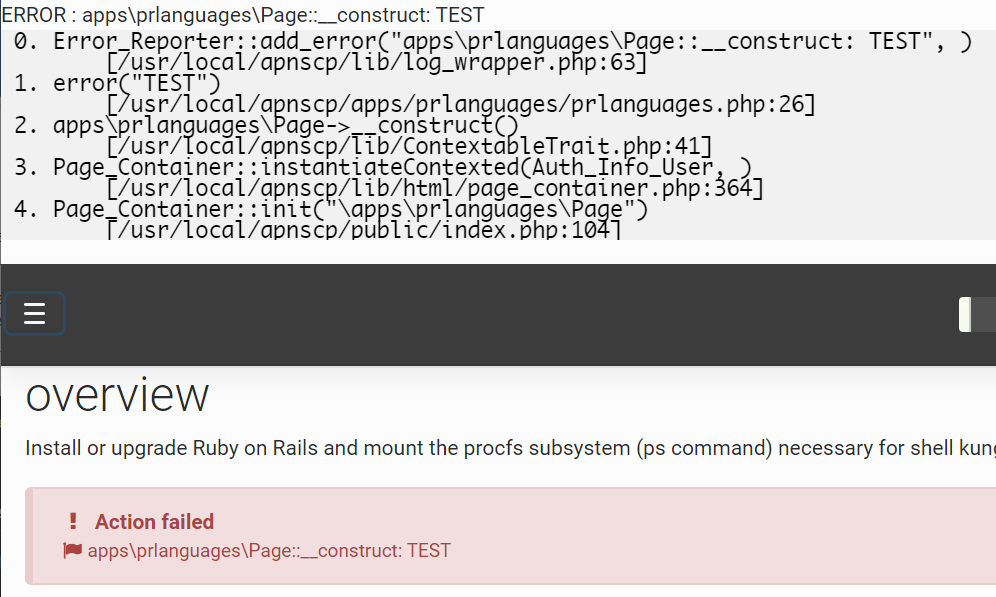
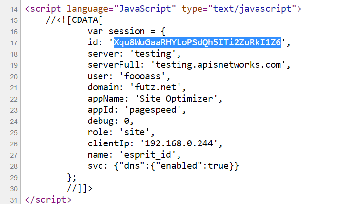

# Debugging

ApisCP may emit debugging information when **debug mode** is enabled. You can enable debugging on a per-request basis, or globally using *cp.debug* [Scope](admin/Scopes.md). Backtraces (code pathways) can be enabled by setting *[core]* => *debug_backtrace_qualifier*. Backtraces give context around how an error occurred, making them invaluable for debugging.

`cpcmd scope:set cp.debug true` enables debugging mode globally.

`cpcmd scope:set cp.config core debug_backtrace_qualifier -1` enables backtraces for all reporting classes (fatal, error, warning. info, deprecated, and debug) as well as exceptions. Increasing verbosity levels inherit lower levels. **Backtraces are mandatory** when reporting issues.

The following table is only relevant when panel debugging is enabled.

| Level | Features                                   |
| ----- | ------------------------------------------ |
| 0     | Disabled, no backtraces                    |
| 1     | Errors - error()                           |
| 2     | Warnings - warn()                          |
| 3     | Informative remarks - info()               |
| 4     | Deprecated - deprecated_fn(), deprecated() |
| -1    | All  above classes + debug()               |



`env DEBUG=1 cpcmd common:whoami` executes the [whoami](https://api.apiscp.com/class-Common_Module.html#_whoami) method in common module. This method simply returns the current username. A special module [test](https://api.apiscp.com/class-Test_Module.html) is available in debug mode to facilitate development. Only this request operates in debug mode ensuring appropriate isolation in a production environment.

```bash
# env DEBUG=1 cpcmd test:benchmark common_whoami
benchmark common_whoami
time: 0.01 sec (1000 rounds; 0.0051 ms each; 195429.32 per second)

0.0051169395446777

# env DEBUG=0 cpcmd test:benchmark common_whoami
ERROR   : test_benchmark: command does not exist
----------------------------------------
MESSAGE SUMMARY
Reporter level: ERROR
----------------------------------------
ERROR: test_benchmark: command does not exist
```

When in debug mode, housekeeping and cron services are disabled as well as job runner. Housekeeping/cron tasks may not be invoked traditionally. Job runner invocation is covered under [Jobs](#jobs).

Verbosity may be selectively controlled via `env VERBOSE=n cpcmd` where *n* is a corresponding level in the table above. Verbosity cannot be selectively changed in the frontend. Set *[core]* => *debug_backtrace_qualifier* then target sessions for debug mode below.

## Targeted frontend debug

`misc:debug-session(string $id, bool $mode = true)` enables debugging for a frontend session (DAV, UI, SOAP). Session identifier may be retrieved from a browser session by accessing the `session.id` property. `session.debug` encodes whether debug mode is enabled.

```bash
# Enable debugging for active session Xqu...I1Z6 in browser
env DEBUG=1 cpcmd misc:debug-session Xqu8WuGaaRHYLoPSdQh5ITi2ZuRkI1Z6
# Disable debugging when you're done
env DEBUG=1 cpcmd misc:debug-session Xqu8WuGaaRHYLoPSdQh5ITi2ZuRkI1Z6 false
```

`session.id` may be retrieved from a JavaScript console, cookie source ("esprit_id" de facto cookie name) or from the source.



::: tip
Other morsels of information: *name* is the cookie name, *role* the authenticated role in the set [site, user, admin]. *appId* represents the current app whose structure corresponds to */apps/APPID*.
:::

Any unhandled exceptions will be converted from a placeholder page to the actual stack trace. Appending *?FULL_STACK* to the page request dumps the entire stack, which may be several thousand lines. By default, full stack dumps are disabled in lieu of abbreviated stringified traces.

## Log locations

ApisCP logs messages in a few places. Respective services use their preferred logging locations. This table summarizes common services and their log locations.

All locations are within /var/log unless noted. siteXX is shorthand for /home/virtual/siteXX/fst/. siteXX is the site ID identifier that can be resolved using `get_site_id domain.com`. "..." following siteXX is short-hand for /var/log thus *siteXX ... log* indicates /home/virtual/siteXX/fst/var/log/log. CP_ROOT is the panel home, typically either /usr/local/apnscp or /usr/local/apiscp. Words fully capitalized are symbolic.

| Service                   | Location                   | Remarks                                                      |
| ------------------------- | -------------------------- | ------------------------------------------------------------ |
| Apache                    | httpd/error_log            | HTTP startup                                                 |
| Apache per-site           | siteXX ... httpd/error_log | Per-site error logs, FPM connectivity                        |
| PHP-FPM                   | siteXX ... php-fpm/POOL    | Per-site PHP errors, notices                                 |
| Mail (**all** excl. auth) | maillog                    | SMTP prefixed "postfix". IMAP/POP3 "dovecot". Local delivery "maildrop". Excludes authentication. |
| Mail auth | secure             | Rejections from invalid passwords via PAM |
| FTP                       | vsftpd.log                 |                                                              |
| MySQL                     | /var/lib/mysql/mysqld.log  |                                                              |
| PostgreSQL                | /var/lib/pgsql/X/data/log/ | Circular buffer by day-of-week. X is version major, 11, 10, etc. |
| SSH                       | secure                     | SSH login attempts, successes                                |
| crond                     | cron                       | Periodic services via Dev > Task Scheduler and /etc/cron.d   |
| fail2ban (Rampart) | fail2ban.log | "Found" is log match. "Unban" automatic expiry. |
| ApisCP frontend | CP_ROOT/storage/logs/error_log | Same logging as Apache |
| ApisCP backend | CP_ROOT/storage/logs/start.log | Errors originating from backend |
| Passenger (launcher) | /.socket/passenger/logs | Launcher issues for Python, Ruby, and Node apps |
| Passenger (app) | APPROOT/log | Per-application messages. APPROOT is one directory down from document root. |

### Automated email reporting

ApisCP can be configured to forward a copy of unhandled errors (PHP notices/errors and exceptions) to an email address. Set [core] => bug_report in config.ini. This should be used by developers only, as it generates false positives that are encountered during typical operation.

```bash
cpcmd scope:set cp.config core bug_report email+bugs@domain.com
```

Given the volume generated, plus-address notation or a separate email address is recommended to facilitate mail filtering by your SMTP provider.

## Backend

You can start the backend broker from the command-line in the foreground. It handles elevation requests from the frontend via the [query()](PROGRAMMING.md#invocation-flow) function in the API.

To enable debugging, run:

```bash
systemctl stop apiscp
cd /usr/local/apnscp/bin
env DEBUG=1 ./apnscpd -f restart
```

When debugging is active, the following tasks are disabled: cron, housekeeping, jobs. Setting *[cron]* => *no_debug* to false allows backend tasks to resume as normal; however, this state is unstable for production environments.

## PHP-FPM status

FPM pools are grouped by site ID identifier and name. By default, one pool is created named after the primary domain. `php:pools()` lists active pools for a site.

`php:pool-status(string $pool = '')` provides the internal PHP-FPM pool status as reported by systemd's notify feature. These values are real-time metrics as seen by the pool manager.

`php:pool-info(string $pool = '')` reports service information from systemd. This command is equivalent to *systemctl show POOLNAME*. *StatusText* is the plaintext value of php:pool-status.

## Jobs

Laravel Horizon is used for jobs unless `has_low_memory` is enabled (via Bootstrapping or *[cron]* => *low_memory* is set in config.ini). Horizon can be manually launched using:

`./artisan horizon`

`misc:get-job-queue()` reports the pending work queue. Pending jobs may be processed using `./artisan queue:work`. An optional flag, --once, processes these jobs singularly.

```bash
# Disable job runner, housekeeping, and cron to prevent jobs from starting
cpcmd scope:set cp.debug true
systemctl restart apiscp

# Validate the queue is empty
cpcmd misc:get-job-queue
# Jobify a command
cpcmd misc:jobify 'common_whoami'
# Validate the queue has 1 job
cpcmd misc:get-job-queue
# Run first job in queue, enable verbose output
./artisan queue:work --once -vvv
# Validate queue is now empty
cpcmd misc:get-job-queue
```

*Jobs are unavailable when the panel is in debug mode unless Horizon has been manually started.*

## Web App installation

Web Apps engaged through the UI are dispatched to a job runner, and may also be installed using API commands. Each app maps to a module named after itself, and follows a common interface:

`NAME:install(string $hostname, string $path = '', array $options = [])`

| Web App   | Module    |
| --------- | --------- |
| Discourse | discourse |
| Drupal    | drupal    |
| Ghost     | ghost     |
| Joomla!   | joomla    |
| Laravel   | laravel   |
| Magento   | magento   |
| NextCloud | nextcloud |
| WordPress | wordpress |

Applications support both generalized options and specific options. The following are common options found in Web > Web Apps:

| Name       | Type   | Remarks                   |
| ---------- | ------ | ------------------------- |
| version    | string | Version number            |
| ssl        | bool   | Enable SSL                |
| user       | string | Optional username of      |
| autoupdate | bool   | Enable automatic updates  |

*Jobs are unavailable when the panel is in debug mode unless Horizon has been manually started.*

## Command listing

`misc:list-commands(string $filter = '')` is a role-aware helper that displays available commands. Used in conjunction with [cpcmd](admin/CLI.md#cpcmd), it provides a convenient interface to filter available commands.

```bash
# Show commands available to Appliance Administrator ("admin" username)
cpcmd misc:list-commands
# Show commands available to site1 Site Administrator
cpcmd -d site1 misc:list-commands
# Show commands available to site1 in the "ghost" module
cpcmd -d site1 misc:list-commands 'ghost:*'
# "l" is an alias and equivalent to the above command
cpcmd -d site1 misc:l 'ghost:*'
```

### Introspection

`misc:command-info(string $filter = '')` provides verbose information about the command, including its method signature and documentation. This can be used to explain what parameters an API command anticipates. Method usage is similar to `list-commands`:

```bash
# Show signature for ghost:install as Site Administrator
cpcmd -d site1 misc:command-info ghost:install
# Show command signature for all commands in "admin" module
cpcmd misc:command-info 'admin:*'
# "i" is an alias and equivalent ot the above command
cpcmd misc:i 'admin:*'
```

## User preferences

Preferences are stored in siteXX/info/USER. `common:load-preferences()` is a convenient interface to show these preferences.

`common:get-user-preferences(string $user)` allows for a Site Administrator access to a user's preferences.

`YAML_INLINE` is an environment variable that controls array folding depth. Increasing folding depth improves readability. The default value is *2*.

```bash
# Show Appliance Administrator's preferences
cpcmd common:load-preferences
# Show preferences for site1's Site Administrator
cpcmd -d site1 common:load-preferences
# Show preferences for user "foobar" on site1
cpcmd -d site1 -u foobar common:load-preferences
# The following command is equivalent
cpcmd -d site1 common:get-user-preferences foobar
# Use YAML_INLINE=n to expand collapsed fields
env YAML_INLINE=4 cpcmd -d site1 common:load-preferences
```

`common:purge-preferences()` will purge the active user's preferences. This may be useful to gauge API interaction or to reset a role to a clean state. `purge-preferences` may only be invoked in debug mode.

```bash
# Get current user preferences
cpcmd common:load-preferences
# Purge all preferences
env DEBUG=1 cpcmd common:purge-preferences
# Preferences for active role is now empty
cpcmd common:load-preferences
```

## Connecting to Redis

Redis manages caching and job queues over a UNIX domain socket. Database 1 is assigned to ApisCP, 2 to jobs, and 3 to rspamd (if utilized), with a decreasing priority assigned to each. Do not issue the `FLUSHALL` command as this will purge rspamd logical replication from PostgreSQL.

```bash
redis-cli -s /usr/local/apnscp/storage/run/redis.sock
# Show memory usage
info memory
# Show stored keys
keys *
```

## API bypasses

You may bypass API permissions by using a surrogate module. This allows for rapid prototyping of individual API methods which may otherwise be restricted. Surrogates are covered in detail in [PROGRAMMING.md](PROGRAMMING.md).

```bash
<?php declare(strict_types=1);

 class Dns_Module_Surrogate extends Dns_Module {
  public function __construct() {
   parent::__construct();
   // ensure we always win permissions
   $this->exportedFunctions = ['*' => PRIVILEGE_ALL];
  }
  
  public function t() {
   return $this->_cron();
  }
 }
```

You can now interact with the _cron method from the command-line instead of being restricted by API accessibility rules.

```bash
env DEBUG=1 cpcmd dns:t
```

Be careful with this approach. All cross-module calls inherit the current role. This means that you may try calling an API method intended for PRIVILEGE_SITE, as PRIVILEGE_ADMIN. Unless permissions are overwritten with a surrogate, cross-module violations are still blocked.
