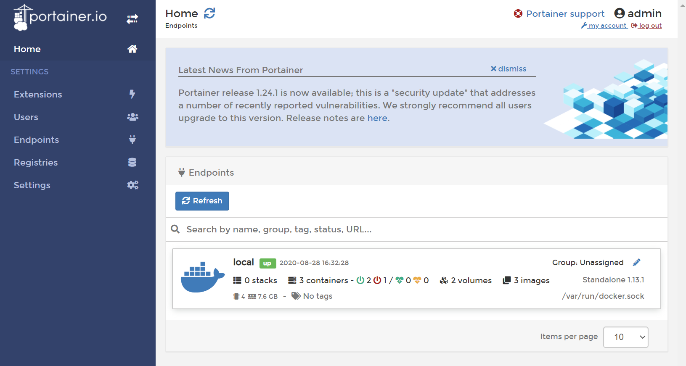

# Docker

ApisCP does not yet provide direct support for Docker, but it's easy to integrate into ApisCP. 

## Installation
Install the `docker` package using `yum`, then replicate it into the [filesystem template](Filesystem.md#filesystem-template).

::: warning Unsafe for multi-tenant operations
The instructions contained herein assume you are the only person managing accounts on this server. 
:::

```bash
yum install -y docker
/usr/local/apnscp/bin/scripts/yum-post.php install -d docker siteinfo
mkdir -p /home/virtual/FILESYSTEMTEMPLATE/siteinfo/etc/sysconfig
cp -dp /etc/sysconfig/docker /home/virtual/FILESYSTEMTEMPLATE/siteinfo/etc/sysconfig/
systemctl fsmount reload
```

Files in `/etc/sysconfig` are typically skipped during filesystem replication. Populate this file to avoid any complications during initialization.

Add a group named `docker`. This group will be used to authorize any user to use the Docker service. We'll come back to this later, adding the group for each site that will have Docker access.

```bash
groupadd --system docker
```

Reconfigure Docker to expose its Unix socket to an accessible location within the filesystem template.

```bash
echo -e '{\n\t"hosts": ["unix:///var/run/docker.sock", "unix:///.socket/docker.sock"],\n\t"group": "docker"\n}' > /etc/docker/daemon.json
systemctl restart docker
ln -s  /.socket/docker.sock /home/virtual/FILESYSTEMTEMPLATE/siteinfo/var/run/docker.sock
systemctl fsmount reload
```

::: warning CentOS 7 rhsm hotfix
Broken package dependencies create a circular link in CentOS 7 for RedHat's subscription manager, required by Docker. Remove the dangling link, then download the CA/intermediate certs directly from RedHat ([CentOS #14785](https://bugs.centos.org/view.php?id=14785)):

```bash
rm -f /etc/rhsm/ca/redhat-uep.pem 
openssl s_client -showcerts -servername registry.access.redhat.com -connect registry.access.redhat.com:443 </dev/null 2>/dev/null | openssl x509 -text > /etc/rhsm/ca/redhat-uep.pem
cp -fpldR /etc/rhsm /home/virtual/FILESYSTEMTEMPLATE/siteinfo/etc/

```
:::

## Authorizing Docker usage per site
For each site to enable Docker, create the group then add the Site Administrator (or any sub-user) to the `docker` group.

Assume we're adding the Site Administrator for apiscp.com to use Docker. `get_config`, a [CLI helper](CLI.md#get-config), will help lookup the Site Administrator (`admin_user` field) for a given site.

```bash
chroot /home/virtual/apiscp.com/ groupadd --system -g "$(getent group docker | cut -d: -f3)" docker
chroot /home/virtual/apiscp.com/ usermod -G docker -a "$(get_config apiscp.com siteinfo admin_user)"
# Switch to the Site Admin for apiscp.com
su apiscp.com
# Confirm the user is part of "docker" group
id
# Sample response:
# uid=9999(myadmin) gid=1000(myadmin) groups=1000(myadmin),10(wheel),978(docker)
```

## First container

For a hypothetical first run app, [Apache Zeppelin](https://zeppelin.apache.org/docs/0.7.0/install/docker.html) is used as it's what initiated this document.

Create a subdomain or addon domain. Inside the [document root](https://kb.apnscp.com/web-content/where-is-site-content-served-from/) add a [.htaccess](https://kb.apnscp.com/guides/htaccess-guide/) file that will proxy all requests to the container.

For example, if the port argument is `--port 8082:8080` then externally, 8082 is being forwarded internally to the Docker container expecting traffic on 8080. Knowing this, prepare the .htaccess file:

```
RewriteEngine On
RewriteCond %{HTTP:Upgrade} =websocket [NC]
RewriteRule ^(.*)$ ws://localhost:8082/$1 [L,QSA,P]
RewriteRule ^(.*)$ http://localhost:8082/$1 [L,QSA,P]
```

::: tip Websocket disabled by default
Enable Websocket support by loading the [wstunnel](https://httpd.apache.org/docs/2.4/mod/mod_proxy_wstunnel.html) module. Not every application utilizes Websockets, so check with your vendor documentation. Zeppelin requires Websocket for use.

Add `LoadModule proxy_wstunnel_module modules/mod_proxy_wstunnel.so` to `/etc/httpd/conf/httpd-custom.conf`, then run `htrebuild` to activate configuration changes.
:::

Run Zeppelin, and you're done!

```bash
docker run -d  -p 8082:8080 --name zeppelin apache/zeppelin:0.9.0 
```

To list active containers, run `docker container list`. To stop a container, run `docker stop CONTAINER-ID`. Adding `--rm` to the task creates a [volatile container](https://docs.docker.com/engine/reference/run/#clean-up---rm), which will remove created data on exit.

This task may be added to boot on startup using the `@reboot` token in crond:

```bash
crontab -e
# Next add the following line
@reboot docker run -d  -p 8082:8080 --name zeppelin apache/zeppelin:0.9.0 
```

## Container management

[Portainer](https://portainer.io) is a tool made for managing a collection of Docker containers. Given the sensitive nature of sending credentials across the wire, this subdomain (*portainer.apiscp.com*) will require HTTPS and set an HTTP strict transport security header to ensure future connections use SSL.



First create the persistent volume store, then run it.

```bash
docker volume create portainer_data
docker run -d -p 8000:8000 -p 9000:9000 --name=portainer --restart=always -v /var/run/docker.sock:/var/run/docker.sock -v portainer_data:/data portainer/portainer
```

Lastly, connect it using Apache to the backend container.

```
RewriteEngine On
DirectoryIndex disabled

Header always set Strict-Transport-Security "max-age=63072000;"
RewriteCond %{HTTPS} !=on
RewriteRule ^(.*)$ https://%{HTTP_HOST}/$1 [R,L]

RequestHeader set X-Forwarded-Proto "https"
RewriteCond %{HTTP:Upgrade} =websocket [NC]
RewriteRule ^(.*)$ ws://localhost:9000/$1 [L,QSA,P]
RewriteRule ^(.*)$ http://localhost:9000/$1 [L,QSA,P]
```

That's all there is!
