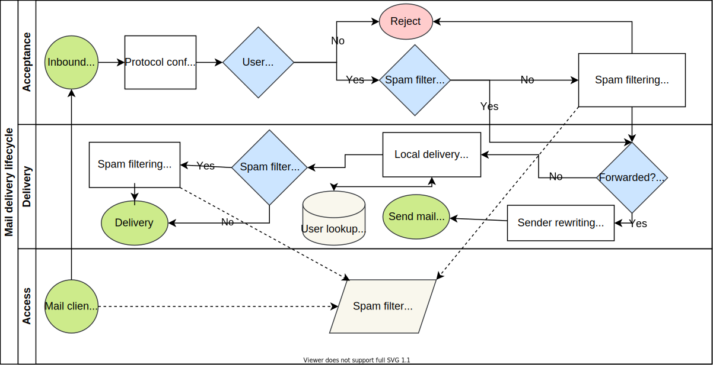

Mail can be self-hosted by using the `builtin` mail provider or remotely hosted by using any other provider. Self-hosted mail is handled by several components summarized below. **Providers** that provide turnkey configuration for third-party services.

## Providers

* [builtin](#builtin-services): utilizes ApisCP's mail stack below
* [gmail](https://github.com/apisnetworks/apiscp-mail-gmail): Gmail
* [mxroute](https://github.com/apisnetworks/apiscp-mail-mxroute): MXRoute
* null: dummy driver that always returns success

## Builtin services

Several services work together. The table and diagram provide a summary of these services. Documentation is provided where appropriate.

| Service                         | Role                                                        |
| ------------------------------- | ----------------------------------------------------------- |
| [Postfix](SMTP.md)              | Receives and sends mail                                     |
| [Dovecot](Dovecot.md)           | IMAP/POP3                                                   |
| [rspamd](rspamd.md)             | Spam filtering, outbound milter (policy, DKIM)              |
| [SpamAssassin](SpamAssassin.md) | Spam filtering, *does not provide outbound milter services* |
| [Authlib](Authlib.md)           | Authentication library for LDA                              |
| [maildrop](LDA.md)              | Local delivery agent                                        |
| [PostSRSd](SMTP.md#srs)         | Sender rewriting scheme support for relayed mail            |
| [Majordomo](Majordomo.md)       | Mailing list                                                |



::: details Postfix services
`smtpd`, `postscreen`, `verify`, `virtual`, and `smtp` are internal Postfix services. You can learn more about these services in [SMTP.md](SMTP.md) or from Postfix's [documentation](http://www.postfix.org/documentation.html).
:::

## Spam filters

Both [SpamAssassin](https://spamassassin.apache.org) and [rspamd](https://rspamd.com) are offered as drop-in anti-spam solutions. SpamAssassin has better accuracy with minimal configuration, but rspamd excels in throughput and features, doubling as a DKIM signer and policy milter.

Of particular importance is the placement of rspamd within the stack, which operates on inbound mail before-queue that allows rejection *at connection* that terminates an SMTP connection with a 5xx error message ("571 delivery not authorized" specifically). SpamAssassin will not generate a delivery status notification for messages marked as spam as placement before-queue induces too much connection delay that discourages timely delivery by impatient SMTP clients. In a mature rspamd cluster, filtering takes approximately 0.15 seconds per message versus 4.5 seconds in SpamAssassin.

### Selection

Spam filter can be configured using `cpcmd scope:set mail.spam-filter FILTER` where *FILTER*  is either `spamassassin` or `rspamd`. rspamd can run in piggyback mode, that is to say it passively learns from SpamAssassin while providing policy milter capabilities. This can be enabled by enabling rspamd while selecting SpamAssassin as the spam filter.

```bash
cpcmd scope:set mail.rspamd-piggyback true
# Above implicitly sets spamfilter='spamassassin' and rspamd_enabled=true in Bootstrapper
```

