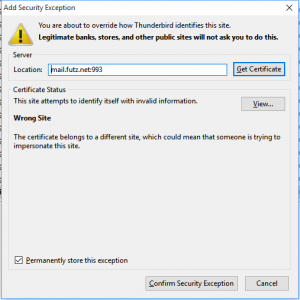
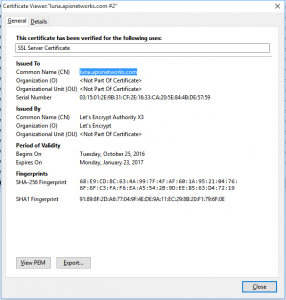

## Overview

IMAP, POP3, and SSL that connect over SSL either via STARTTLS on port 143/110/587 or 993/995/465 respectively fail with a certificate warning without any symptoms prior to October 25, 2016. Symptoms include the following dialog from Thunderbird:

\[caption id="attachment\_1375" align="aligncenter" width="300"\] SSL certificate rejection on initial connection\[/caption\]

\[caption id="attachment\_1376" align="aligncenter" width="286"\] SSL certificate mismatch inspection after clicking "View" in the "Add Security Exception" dialog\[/caption\]

## Cause

With the proliferation of free SSL certificates via [Let's Encrypt](https://www.letsencrypt.org), vendors have begun to tighten requirements on SSL certificate validation to thwart hackers. Thunderbird and Mail (iOS) now require that the **mail server name match a name in the Subject Alternative Name extension**. Without such match the aforementioned warning is generated.

## Solution

Change your mail server name, both incoming and outgoing, to [match the server name](https://kb.apiscp.com/platform/what-is-my-server-name/) on which you are hosted. In the initial example, "_mail.futz.net_" would be changed to "_luna.apiscp.com_".

### Thunderbird

See [KB: Manual Account Configuration](https://support.mozilla.org/en-US/kb/manual-account-configuration)

### Outlook

See [KB: Change email account-settings](https://support.office.com/en-us/article/Change-email-account-settings-58b62e89-6a9b-467b-8865-d5633fcacc3f)

## Additional Notes

This has been corrected in account provisioning as of October 26, 2016.
