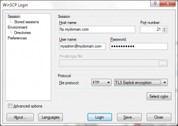
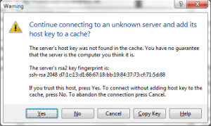

## Overview

FTP is a protocol that allows you to easily upload, download, and modify permissions of files for your web site. In fact, it's the recommended method of managing files on your account offering better flexibility than File Manager within the [control panel](https://kb.apiscp.com/control-panel/logging-into-the-control-panel/ "Logging into the control panel").

## Logging in

FTP follows the same login as [e-mail](https://kb.apiscp.com/e-mail/accessing-e-mail/ "Accessing e-mail") and [terminal](https://kb.apiscp.com/terminal/accessing-terminal/ "Accessing terminal") services on your account. Your login is of the form: _username_@_domain_.

Note: some FTP clients misinterpret @ in the login as a hostname delimiter, common when accessing FTP as a single command, in such circumstances replace @ with #: _username_#_domain._

### Supported protocols

FTP supports normal, unencrypted communication in addition to Auth TLS (sometimes called "_explicit encryption_"). Both use the normal FTP port, 21.

SFTP requires [terminal access](https://kb.apiscp.com/terminal/accessing-terminal/ "Accessing terminal") and wraps FTP around a secure terminal session. SCP works similar to SFTP, but only transfers files and nothing more.

### **Connection example**

Below are connection screen examples in both WinSCP and FlashFXP using the same conditions:

- Username is `myadmin`
- Domain is `mydomain.com`
- FTP login, then, is `myadmin@mydomain.com` or `myadmin#mydomain.com`
- FTP password is the same password used to sign into the control panel ([need a reset](https://kb.apiscp.com/control-panel/resetting-your-password/ "Resetting your password")?)
- FTP port is `21`
- FTP protocol is either unencrypted or encrypted using Auth TLS (explicit encryption)

Note: just now switching hosting providers to Apis Networks? Use the [server name](https://kb.apiscp.com/platform/what-is-my-server-name/ "What is my server name?") instead of your domain name to access FTP before [changing DNS](https://kb.apiscp.com/dns/how-long-does-dns-propagation-take/ "How long does DNS propagation take?").

\[caption id="attachment\_427" align="alignnone" width="300"\] Example application connecting to FTP using WinSCP + encrypted communication.\[/caption\]

\[caption id="attachment\_428" align="alignnone" width="300"\] Example quick connect settings in FileZilla. No encrypted communication available.\[/caption\]

### Certificate message connecting with TLS

Upon first connection, the FTP client is presented with a warning concerning the _host key_ (or _server key_). This is a normal side-effect of using self-signed certificates on the servers. Click Yes/Proceed to continue connecting to the FTP server.

\[caption id="attachment\_429" align="alignnone" width="300"\] A notice first presented by a self-signed certificate installed on the FTP server in WinSCP.\[/caption\]

## Recommended FTP clients

- **Windows**: [WinSCP](http://winscp.net/eng/index.php), [Rightload](http://rightload.org/) (right-click to upload from your desktop, we love this), [FlashFXP](http://www.flashfxp.com) ($30, supports [FXP](http://en.wikipedia.org/wiki/File_eXchange_Protocol)), [WebDrive](http://www.webdrive.com/products/webdrive) ($50, mount FTP as drive)
- **Mac OS**: [Cyberduck](https://cyberduck.io), [Transmit](http://www.panic.com/transmit) ($35), WebDrive ($50)
- **Linux**: [gFTP](http://gftp.seul.org/), [FileZilla](https://filezilla-project.org/), [Fuse](http://curlftpfs.sourceforge.net/) (mount FTP as a drive)
- **Web Client**: visit [ftp.apiscp.com](http://ftp.apiscp.com) to use our web-based FTP client

**Note**: [FileZilla](https://filezilla-project.org/) was removed from our list of recommended Windows clients for protocol problems reported by our users with older versions. This has since been resolved, but now its installer program is stuffed with opt-out [adware](http://en.wikipedia.org/wiki/Adware) from Sourceforge, its content-distribution partner. It is available as an option, but _not recommended_ for third-party reasons.
