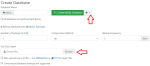
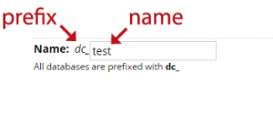

## Overview

Additional MySQL databases, used for storing application data, may be created quickly within the [control panel](https://kb.apiscp.com/control-panel/logging-into-the-control-panel/ "Logging into the control panel") via **Databases** > **MySQL Manager**. When a database is created, grants are automatically setup to permit the primary user access to the database. In multi-user environments, you may wish to create a separate user to keep your master password confidential.

## Solution

### Creating a database

1. Visit **Databases** > **MySQL Manager**
2. Enter the new database name under **Name**
    - Optionally deselect _Backup database_ if you wish for _no backups_ to be made. If the database becomes corrupted, then there is no way to restore it, so be careful.
3. Optionally click **Advanced** to toggle the backup frequency, count, and a file to import from. For larger databases, you may wish to hold 2 database copies and backup every day. This would give you 48 hours of protection. Database import files may be plain-text or compressed.
    
    Importing a database
    
4. Click **Create**
5. A database comprised of your _database prefix_ and _name_ will be created.
    - In the below example, this database will be named `dc_test`
        
        \[caption id="attachment\_595" align="alignnone" width="300"\] Database prefix illustration in MySQL Manager\[/caption\]
        
         

### Connecting

To connect to this database, use a hostname value of `localhost`, your username, and your database password. If this password is forgotten at any time, you must [reset it](https://kb.apiscp.com/mysql/resetting-mysql-password/ "Resetting MySQL password") unless it has been used elsewhere.

**Note:** localhost should be used for all local connectivity, unless [connecting remotely](https://kb.apiscp.com/mysql/connecting-remotely-mysql/ "Connecting remotely to MySQL") or connecting using database connection pooling ("DBCP") in Java. With DBCP, use a hostname of `127.0.0.1` - TCP socket over localhost.

### Permitting access by other users

By default, only the primary user is permitted access to a newly created database. To enable another user read, write, or even a mix of privileges, they must be explicitly granted via **Databases** > **MySQL Manager** >  **List Users and Databases**.

1. Select the database
2. Enable **READ** or **WRITE** privileges to allow the user read-only, read-write, or write-only access.
    - For normal operation, both READ and WRITE should be selected.
    - Granular permissions may be selected by clicking on **Advanced**. Use at your own risk.
3. Click **Save**

## See also

- [Privileges provided by MySQL](http://dev.mysql.com/doc/refman/5.1/en/privileges-provided.html)
