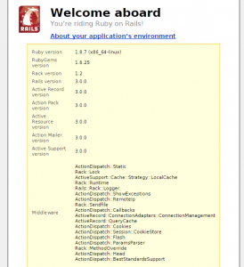
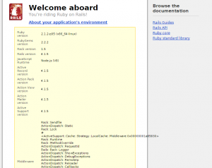

## Overview

[Ruby on Rails](http://en.wikipedia.org/wiki/Ruby_on_Rails) is a web application framework built on the Ruby programming language. [Older hosting platforms](https://kb.apiscp.com/platform/determining-platform-version/ "Determining platform version") (< v4.5) support up to Rails 2. Newer platforms before v6 support Rails 3. v6+ platforms support Rails 2-4+ and Ruby 1.8-2.2+ using [rvm](http://rvm.io).

Need a [migration](https://kb.apiscp.com/platform/migrating-another-server/ "Migrating to another server") to a newer platform to support Rails 4? Just open a ticket in the [control panel](https://kb.apiscp.com/control-panel/logging-into-the-control-panel/ "Logging into the control panel")!

## Getting Started

This guide only covers platform versions 4.5+.

### Rails 2+ on v6+ platforms

On Sol and [newer platforms](https://kb.apiscp.com/platform/determining-platform-version/ "Determining platform version"), you can switch between Ruby versions, and install multiple Rails to suit your requirements. These platforms support Rails versions 2.0 to 4 and beyond.

1. Log into the [terminal](https://kb.apiscp.com/terminal/accessing-terminal/ "Accessing terminal")
2. Determine what version of Ruby to use with `[rvm use](https://kb.apiscp.com/ruby/changing-ruby-versions/)`.
    - This must be used at least once on your account to configure rvm's shim system `cd /var/www ; rvm use 2.2.2`
3. Issue `gem install --no-rdoc --no-ri passenger rails` to install Rails from the shell
    - If using an old version of Ruby (less than 2.0), specify `gem install -y --no-rdoc --no-ri passenger rails`
4. Change to /var/www: `cd /var/www`
5. Initialize a new application: `rails myapp`
6. Assign a `PassengerRuby` to your application
    - Generate the proper [htaccess](https://kb.apiscp.com/guides/htaccess-guide/ ".htaccess Guide") directive with `passenger-config --ruby-command`
    - Select the _Apache_ directive, e.g. (use the italicized directive)
        - To use in Apache: _PassengerRuby /.socket/ruby/gems/ruby-2.1.2/wrappers/ruby_
        - **Important**: select the PassengerRuby with _wrappers/_ in the path, not _bin/_. The wrapper populates necessary gem environment variables
    - Add that [Apache directive](https://kb.apiscp.com/guides/htaccess-guide/ ".htaccess Guide") to a file called `.htaccess` located within the public/ directory, `/var/www/myapp/public` in this case.
7. Verify all dependencies are installed in /var/www/myapp. This will take a few minutes to complete:
    - cd /var/www/myapp
        bundle install
        
8. Connect your Rails application to a URL:
    - Visit **Web** > **Subdomains** within the [control panel](https://kb.apiscp.com/control-panel/logging-into-the-control-panel/ "Logging into the control panel"). Create a new subdomain called _rails_ with the [document root](https://kb.apiscp.com/web-content/where-is-site-content-served-from/ "Where is site content served from?") `/var/www/myapp/public`
        
        \[caption id="attachment\_412" align="alignnone" width="300"\] Adding a Rails subdomain in the CP.\[/caption\]
9. Rails application will start in Production mode, but requires a [secret key](http://edgeguides.rubyonrails.org/upgrading_ruby_on_rails.html#config-secrets-yml). Set `secret_key_base` in `config/secrets.yml`
10. _**Enjoy!**_

\[caption id="attachment\_793" align="alignleft" width="274"\] Sample install from Rails v3 installed using Ruby 1.8\[/caption\]

\[caption id="attachment\_795" align="alignleft" width="300"\] Sample install from Rails v4 using Ruby 2.2\[/caption\]

### Rails 2 or 3 on pre-v6

Running on an older platform and nestled in your home? No problem! Rails 2 or 3 can be setup using mod\_passenger and rubygems.

1. Log into the [terminal](https://kb.apiscp.com/terminal/accessing-terminal/ "Accessing terminal")
2. Issue `gem install -v '< 4.0' --no-rdoc --no-ri -y rails`
    - Ruby on Rails will install the latest available 3.x release
    - \--no-rdoc and --no-ri will omit documentation and irb files to reduce storage consumption
    - Servers are tied to Ruby 1.9.1 (v4.5) or 1.9.3 (v5) depending upon platform
3. Change to /var/www:  `cd /var/www`
4. Initialize a new application: `rails myapp`
5. Assign a `RailsBaseUri` and `PassengerAppRoot` for your application
    - Both are [Apache directives](https://kb.apiscp.com/guides/htaccess-guide/ ".htaccess Guide") added to a file called `.htaccess` located within the public/ directory, `/var/www/myapp/public` in this case.
    - For RailsBaseUri, specify the directive: `RailsBaseUri /`
    - For PassengerAppRoot, take the HTTP base path within the control panel under **Account** > **Summary** > **Web** > **HTTP Base Path**. PassengerAppRoot is the _HTTP Base Path_ + _App Path in Terminal_, e.g.
        - `PassengerAppRoot /home/virtual/site12/fst/var/www/myapp`
    - Add  both lines to your `.htaccess` file.
6. Edit `environment.rb` in `myapp/environments/` to load sqlite3.
    - Navigate to **Rails::Initializer** and add config.gem:
        
        Rails::Initializer.run do |config|
           # Settings in config/environments/\* take ...
           # Comments ...
         
           config.gem "sqlite3"
         
           # more comments ...
        end
        
7. Connect your Rails application to a URL:
    - visit **Web** > **Subdomains** within the [control panel](https://kb.apiscp.com/control-panel/logging-into-the-control-panel/ "Logging into the control panel"). Create a new subdomain called _rails_ with the [document root](https://kb.apiscp.com/web-content/where-is-site-content-served-from/ "Where is site content served from?") `/var/www/myapp/public`
        
        \[caption id="attachment\_412" align="alignnone" width="300"\] Adding a Rails subdomain in the CP.\[/caption\]
8. _**Enjoy!**_

## Switching environments

By default, Rails applications start in production mode, which ratchets down verbosity and runs faster than development mode. During the course of development it may be necessary to change to development mode to facilitate debugging or testing out interim features. To make a change, add `SetEnv RAILS_ENV development` to your [.htaccess](https://kb.apiscp.com/guides/htaccess-guide/ ".htaccess Guide") file located within the public/ folder of the application.

## Restarting your app

An app may either be restarted upon each request or at a single point. To restart an app every invocation, create a file called always\_restart.txt in tmp/: `touch tmp/always_restart.txt`. To perform a single restart, create a file called restart.txt in tmp/: `touch tmp/restart.txt`. Passenger, which handles process management, will compare the timestamp with its internal record and restart as necessary. To restart a second time, either reissue the command or delete, then recreate the file to update its modification time.

## Viewing launcher errors

On newer v6 platforms, launcher errors may be viewed through the consolidated log file, `/var/log/passenger.log`.

## See also

- [Ruby on Rails Guides](http://guides.rubyonrails.org/index.html)
- [Ruby on Rails Tutorial](https://www.railstutorial.org/book): Learn Web Development with Rails e-book
- [A better way to manage the Rails secret token](http://daniel.fone.net.nz/blog/2013/05/20/a-better-way-to-manage-the-rails-secret-token/)
- Concurrent implementations of Rails [v2](http://rails2.futz.net), [v3](http://rails3.futz.net), and [v4](http://rails4.futz.net) on [Sol](http://apiscp.com/server-lookup?domain=futz.net) (v6 platform)
