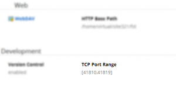

## Overview

Some applications require persistence to continue to run after a page view has concluded. Node.js or other backend socket/server pairs connect a front-end process, like a web page view, with a backend process such as data crunching. For such circumstances, clients with [Developer+ packages](https://kb.apiscp.com/terminal/is-terminal-access-available/ "Is terminal access available?") may run daemons necessary for their web site to operate – _please no game servers, bitcoin miners, TeamSpeak servers, IRC bouncers, etc_.

## Port Ranges

Port ranges are available within the [control panel](https://kb.apiscp.com/control-panel/logging-into-the-control-panel/ "Logging into the control panel") under **Account** > **Summary > Development**. Port ranges vary from server-to-server and are based primarily on provisional precedence. Always check the control panel to make sure you're listening in the right port range, which is _always_ between the port range _40010_ and _49999_. Failure to adhere to this port range will result in automatic termination of the offending service.

\[caption id="attachment\_317" align="alignnone" width="300"\] TCP port range available within the control panel under Account > Summary > Development.\[/caption\]

## TCP or Socket?

TCP is only necessary if you need _a service external from the server to communicate with it_. Otherwise, a local UNIX socket is not only [~33% faster](http://momjian.us/main/blogs/pgblog/2012.html#June_6_2012), because the TCP stack is eschewed, but also only applications that originate on the server may access the service. Effectively, a firewall is erected prohibiting communication from third-parties outside the network. You can run as many services that listen on a UNIX domain socket that your account needs.

## See Also

[Compiling programs](https://kb.apiscp.com/terminal/compiling-programs/ "Compiling programs")
