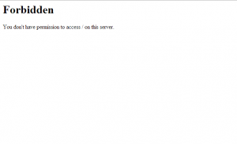

Site statistics can be viewed, in raw form, through access logs available via `/var/log/httpd/access_log`. Likewise, errors that may arise from improperly-configured PHP scripts or general diagnostics are available in error logs via `/var/log/httpd/error_log`. These errors are typically manifested as 550, 500, 403, or status codes also more commonly referred to as "Internal Server Error".

Java errors through Tomcat are available in a separate log file, `/var/log/catalina.out`.

CGI errors are located in `/var/log/httpd/suexec.log` or `/var/log/httpd/suexec_log` depending upon [platform version](https://kb.apiscp.com/platform/determining-platform-version/ "Determining platform version").

Ruby on Rails on [platform versions](https://kb.apiscp.com/platform/determining-platform-version/ "Determining platform version") 6+ are accessible via `/var/log/passenger.log`.

 

\[caption id="attachment\_325" align="alignnone" width="300"\] Example 403 Forbidden error page\[/caption\]
