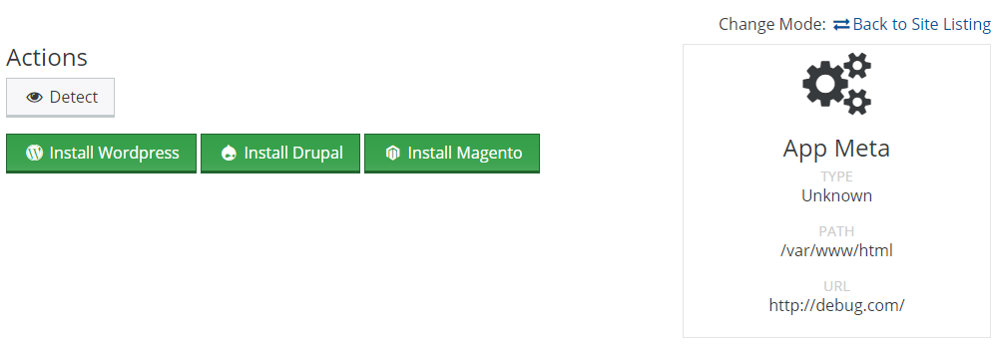
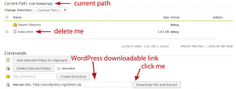
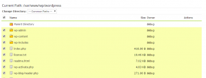
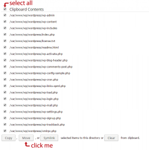
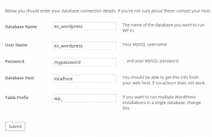

## Overview

WordPress is a popular content-publication software that can do everything from run a simple four-page web site to an eCommerce shop. Even our knowledgebase is run with WordPress, a few plugins, and a theme.

## Installing WordPress

### One-Click Method

As of May 10, 2016 one-clicks [have returned](http://updates.apiscp.com/2016/05/one-clicks-are-back/) to the control panel. To update within the control panel:

1. Go to **Web** > **Web Apps** within the [control panel](https://kb.apiscp.com/control-panel/logging-into-the-control-panel/)
2. Select the hostname from the dropdown list
    - If you would like to install WordPress in a folder within the domain, click the dropdown and select _Edit Subdir_. Select or create the folder.
        
        \[caption id="attachment\_1294" align="aligncenter" width="385"\] Edit Subdir indicator in Web > Web Apps\[/caption\]
3. Click **Install WordPress** under Actions
4. WordPress will install. A verification email will be sent to the administrative address on the account confirming your login and password.
    - The destination must be empty. If there are files present, remove them first via **Files** > **File Manager**.
        
        \[caption id="attachment\_1296" align="aligncenter" width="1002"\] WordPress and other web app installation options in apnscp.\[/caption\]

### Manual Method

WordPress takes about 5 minutes to install and 3 minutes to configure. Maybe more, maybe less depending upon how easily you get sidetracked.

There are 3 main components to setting WordPress up: (1) configuring a database to store information, (2) uploading the files, (3) changing permissions to allow write access. For speed, we recommend using a [FTP client](https://kb.apiscp.com/ftp/accessing-ftp-server/ "Accessing FTP server") or [terminal](https://kb.apiscp.com/terminal/accessing-terminal/ "Accessing terminal") to setup WordPress. This will cover setting up WordPress using the control panel exclusively.

### Prerequisites

1. Login to the [control panel](https://kb.apiscp.com/control-panel/logging-into-the-control-panel/ "Logging into the control panel")
2. Create [a database](https://kb.apiscp.com/mysql/creating-database/ "Creating a database") to store data via **Databases** > **MySQL Manager**
    - In this example, this database will be called `wordpress` with an account database prefix `ex_`
3. Connect WordPress to a folder ([document root](https://kb.apiscp.com/web-content/where-is-site-content-served-from/ "Where is site content served from?")) on your account. If installing WordPress on the primary domain, skip this step, WordPress will be installed under `/var/www/html`
    - On a new domain, visit **DNS** > **Addon Domains** to add a new domain + document root
    - As a subdomain, e.g. _http://blog.mydomain.com_, via **Web** > **Subdomains** to add a new subdomain + document root
    - WordPress will be installed on a subdomain called `blog` with a folder location `/var/www/wp`

### Uploading WordPress

There are three methods of getting WordPress on your account ordered from fastest to slowest and additionally sorted from most to least difficult. Choose whichever works best for you!

#### Option 1: Downloading from terminal

This is available only for accounts [with terminal access](https://kb.apiscp.com/terminal/is-terminal-access-available/ "Is terminal access available?").

1. Login to the [terminal](https://kb.apiscp.com/terminal/accessing-terminal/ "Accessing terminal")
2. Switch to the [document root](https://kb.apiscp.com/web-content/where-is-site-content-served-from/ "Where is site content served from?")
    - `cd /var/www/wp`
3. Download and extract WordPress using [wget](http://apiscp.com/linux-man/man1/wget.1.html)
    - `wget http://wordpress.org/latest.zip && unzip latest.zip && rm -f latest.zip `
4. Move WordPress from `wordpress/` back to `/var/www/wp`
    - `cd wordpress/ && mv * ../ && cd .. && rmdir wordpress`

#### Option 2: Uploading with FTP

This is the fastest method, supported by all accounts, to get WordPress up and running:

1. Download the current WordPress distribution, [latest.zip](https://wordpress.org/latest.zip)
2. Login to the [FTP server](https://kb.apiscp.com/ftp/accessing-ftp-server/ "Accessing FTP server")
3. Navigate to remote directory designated as [document root](https://kb.apiscp.com/web-content/where-is-site-content-served-from/ "Where is site content served from?") for WordPress
4. Upload those files located inside `wordpress/` in the `latest.zip` file to the remote directory

#### Option 3: Uploading files in control panel

[FTP](https://kb.apiscp.com/ftp/accessing-ftp-server/ "Accessing FTP server") is much quicker to upload files. If you're comfortable with using a FTP client, use a FTP client to save some time (and a considerable number of steps).

1. Visit **Files** > **File Manager** within the control panel
2. Switch to the new folder by selecting **Change Directory** > **Browse...** under Current Path
3. Within **Commands** > **Remote URL **enter `http://wordpress.org/latest.zip` then click **Download and Extract**
    - Delete `index.html` if it exists. This is a placeholder file and will take precedence over WordPress's [index file](https://kb.apiscp.com/web-content/changing-index-pages/ "Changing index pages"), `index.php`. To do so, hover over the file, go to _Actions_, select the _Delete_ action
    - WordPress' latest version will be downloaded to your account, then extracted in the current directory
        
        \[caption id="attachment\_604" align="alignnone" width="300"\] Summary of actions to do in File Manager: remove index.html, enter URL, click button.\[/caption\]
4. Navigate to the newly created `wordpress/` directory to move all files down a level
5. Select all files, under **Commands** > ****Add Selected File(s) to Clipboard****
    
    \[caption id="attachment\_605" align="alignnone" width="300"\] WordPress bulk selection files in the control panel. These files will be moved down a directory.\[/caption\]
6. Move back up a directory by clicking **Parent Directory**
7. Select all files under **Clipboard Contents**, click ****Move****
    
    \[caption id="attachment\_606" align="alignnone" width="297"\] Managing WordPress clipboard contents to move up a directory.\[/caption\]
8. Additionally remove the now empty `wordpress/` directory. Select the directory, **Commands** > **Delete Selected Files** + select **recursive**

### WordPress installation wizard

Now that WordPress is up and running, we need to setup a default configuration.

1. Visit your WordPress web site
    - In our example, from the Prerequisites step, it would be _http://blog.mydomain.com_
2. Plug in your database details
    - **Database Name** is the database created earlier in **Databases** > **MySQL Manager**
        - In our example, this is `ex_wordpress`
    - **User Name** is either the username logged into the control panel to create the database or another user separately created to access the database
        - Use a separate user to keep your master database password secret
    - **Password** is the corresponding password
        - Need to reset your MySQL password? See KB: [Resetting MySQL password](https://kb.apiscp.com/mysql/resetting-mysql-password/ "Resetting MySQL password")
    - **Database Host** and **Table Prefix** will remain the same (`localhost`/`wp_`)
        
        \[caption id="attachment\_607" align="alignnone" width="300"\] WordPress database settings following this walkthrough.\[/caption\]
3. WordPress needs to store this configuration file inside its application directory. With security restrictions in place (_it's for your own good!_) this file must be uploaded separately either through the terminal, FTP, or control panel.
    - Using a basic text editor like Notepad or TextEdit (see [How to Set Up TextEdit as HTML or Plain Text Editor](http://support.apple.com/kb/TA20406)) copy and paste the wp-config.php contents to a new text file
    - Save this file as `wp-config.php`
    - Upload to your WordPress location, in this example it's `` `/var/www/wp` ``
        
        \[caption id="attachment\_608" align="alignnone" width="300"\] Uploading wp-config.php during installation in the File Manager.\[/caption\]
4. Click **Run the install** in WordPress' installer to complete installation
    - Select a username apart from `admin`
    - Choose a strong password. Accounts are hacked either by outdated WordPress installs or easy password. Stay vigilant and keep your account secure.
5. _Done!_ Now login to your WordPress dashboard and have fun.

### Permit write-access

Write-access will allow WordPress to store files in certain locations, while preventing access to modify/delete/create files elsewhere. This is a necessary precaution to help keep your account safe. See KB: [enabling write-access](https://kb.apiscp.com/wordpress/enabling-write-access/ "Enabling write-access"). By default, we recommend enabling write-access to only `wp-content/uploads/`. Media files may be uploaded through WordPress and files in these directories go through an extra security measure to serve _all files _as if they were media files (prevents hackers from uploading malicious PHP files to these locations).

## See Also

- KB: [Updating WordPress](https://kb.apiscp.com/wordpress/updating-wordpress/ "Updating WordPress")
- KB: [WordPress category](https://kb.apiscp.com/category/wordpress/)
- [WordPress Codex](http://codex.wordpress.org/) (main documentation)
- [WordPress Lessons](http://codex.wordpress.org/WordPress_Lessons)
- [WordPress Themes](https://wordpress.org/themes/)
- [WordPress Popular Plugins](https://wordpress.org/plugins/browse/popular/)
