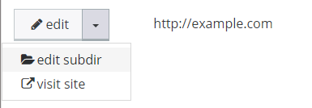

## Overview

Periodic updates for Wordpress and its plugins are released to introduce new features, address performance problems, and resolve [security vulnerabilities](https://cve.mitre.org/cgi-bin/cvekey.cgi?keyword=wordpress). Keeping Wordpress up-to-date is critical to ensure that your site operates without interruption and without being hacked.

## How to update

### One-Click Method

As of May 10, 2016 one-clicks [have returned](http://updates.apiscp.com/2016/05/one-clicks-are-back/) to the control panel on all [v4.5+ platforms](https://kb.apiscp.com/platform/determining-platform-version/). To update within the control panel:

1. Go to **Web** > **Web Apps** within the [control panel](https://kb.apiscp.com/control-panel/logging-into-the-control-panel/)
2. Select the hostname from the dropdown list
    - If WordPress resides in a folder within, click the dropdown and select _Edit Subdir_. Select the folder.
        
        \[caption id="attachment\_1294" align="aligncenter" width="385"\] Edit Subdir indicator in Web > Web Apps\[/caption\]
3. Under App Meta, click **Update** in the Version heading
    - If the app has not been previously detected, select **Detect**
4. WordPress and its plugins have been updated

### Manual FTP Method

1. Login to your WordPress admin portal, typically under `wp-admin/`
    - If WordPress is installed and accessible via http://example.com, then the admin portal is accessible via http://example.com/wp-admin
2. Under **Dashboard**, look for **Updates**. If updates are available, a count of available updates is visible next to it.
    
    \[caption id="attachment\_539" align="alignnone" width="300"\] Logging into the WordPress administrative portal when updates are present\[/caption\]
3. Click on **Updates** > **Update Now** (only if WordPress core application update available) and **Update Plugins** (only if WordPress plugin updates available)
4. Your FTP credentials will already be filled in if you have updated by FTP before. Enter your FTP password
    - Don't know your FTP credentials? See [Accessing FTP server](https://kb.apiscp.com/ftp/accessing-ftp-server/ "Accessing FTP server")
    - Specify `localhost` for **Hostname**
        - Traffic will stay local on the server adding an extra layer of privacy
    - Need to [reset](https://kb.apiscp.com/control-panel/resetting-your-password/ "Resetting your password") your account password?
5. WordPress will automatically download and install available updates.
6. Upon completion, you are redirected to the admin portal, **Updates** is no longer visible, and a confirmation is presented
    
    \[caption id="attachment\_541" align="alignnone" width="300"\] Confirmation splash page once WordPress has been updated.\[/caption\]

### If something goes wrong...

Open a ticket within the [control panel](https://kb.apiscp.com/control-panel/logging-into-the-control-panel/ "Logging into the control panel") under **Help** > **Trouble Tickets**. We can rollback a database backup or filesystem backup depending upon what went wrong. Unless you modify WP core library files manually through the [terminal](https://kb.apiscp.com/terminal/accessing-terminal/ "Accessing terminal") though, this is extremely unlikely to happen.

## Why use FTP?

Using FTP greatly improves account security by requiring roles to restrict access. First, the web server acts as a read-only user for crucial files, but can also [write to media content](https://kb.apiscp.com/php-wordpress/enabling-write-access/ "Enabling write-access") under `wp-content/uploads/`. Second, those crucial files can only be modified by you and through FTP; you have read-write access on all files. FTP password is not stored on the server, so if your account were hacked, damage would be restricted to `wp-content/uploads/`. Servers are configured to restrict scripting languages and serve only static content under that directory, which makes your account very secure.

The downside is that you need to enter your FTP password every time you update. But, you have fantastic security.
